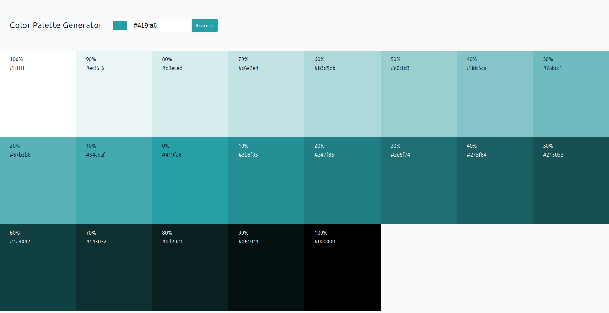
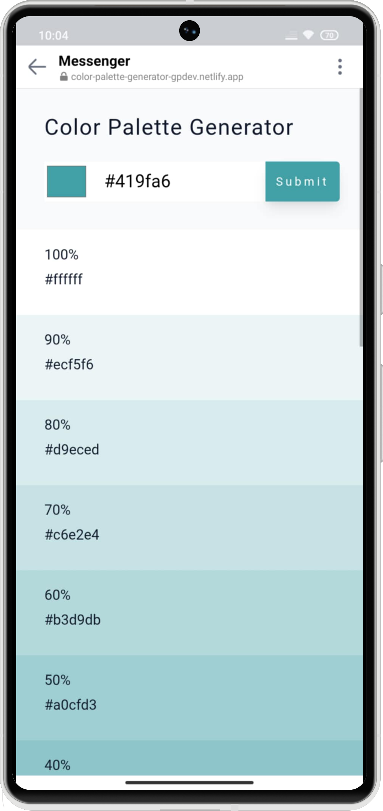

# React Color Palette Generator 🎨


A responsive React application for generating beautiful color palettes from any hex color input. Perfect for designers and developers who need quick access to color shades and tints for their projects. Built to practice React state management, component architecture, and modern CSS techniques.

## 🚀 Live Demo

**View Live on Netlify:**  
[Color Palette Generator Demo ](https://color-palette-generator-gpdev.netlify.app/)

## 🎯 Problem This App Solves:

- Provides instant access to professional color palettes from any hex value
- Eliminates the need for manual color calculation and palette creation
- Offers 21 shades (10 tints, 10 shades, and 1 base color) for each input color
- Includes one-click copy functionality for seamless workflow integration
- Saves valuable time during design system development and prototyping

## 👥 Perfect For:

- UI/UX designers creating color systems
- Frontend developers implementing design systems
- Web designers seeking harmonious color combinations
- Anyone requiring quick color palette generation for projects

## ✨ Features

- **Hex Color Input** - Support for both color picker and manual hex input
- **21-Shade Generation** - Automatic generation of tints and shades (100% to 10%)
- **Copy to Clipboard** - One-click hex code copying with visual feedback
- **Responsive Design** - Optimized grid layout for all screen sizes
- **Visual Feedback** - Toast notifications for errors and success messages
- **Dynamic Styling** - Automatic text color adjustment for readability
- **Interactive Elements** - Hover effects and smooth transitions

## 📸 Project Preview

<table>
  <tr>
    <td align="center"><strong>💻 Desktop View</strong></td>
  </tr>
  <tr>
    <td align="center"></td>
  </tr>
  
  <tr>
    <td align="center"><strong>📱 Mobile View</strong></td>
  </tr>
  <tr>
    <td align="center"></td>
  </tr>
  <tr>
    <td align="center"><em>Mobile responsive view </em></td>
  </tr>
</table>

## 🛠️ Built With

| Tool / Library         | Purpose                      |
| ---------------------- | ---------------------------- |
| ⚡ **Vite**            | Fast build tool & dev server |
| ⚛️ **React 19**        | Component-based UI           |
| 🎨 **Values.js**       | Color shade generation       |
| 📋 **React-Toastify**  | Notification system          |
| 🔑 **Nanoid**          | Unique ID generation         |
| 🎨 **CSS3**            | Flexbox, Grid, animations    |
| 📜 **JavaScript ES6+** | Modern language features     |
| 📋 **Clipboard API**   | Copy functionality           |

## 💡 Implemented Concepts

### State Management

- **useState Hook** - Managing color input and palette state
- **Component Communication** - Parent-child data flow through props
- **Error Handling** - Try/catch for color generation errors

### Component Architecture

- **Modular Components** - Separated Form, ColorList, and SingleColor components
- **Reusable Components** - SingleColor component for consistent rendering
- **Conditional Rendering** - Dynamic text color based on background contrast

### User Experience

- **Form Validation** - Proper error handling for invalid color values
- **Visual Feedback** - Toast notifications and hover effects
- **Accessibility** - Semantic HTML and keyboard navigation support
- **Performance** - Optimized rendering with proper keys

## 🎨 Design

Figma design provided by the course instructor.
[View Figma Design](https://www.figma.com/file/JRDDc3aN6uiBS3yvjbkk0s/Lorem-ipsum?node-id=0%3A1&t=cLtQmBowNmb4V0jP-1)

## 📦 Project Structure

```text
src/
├── components/
│   ├── Form.jsx
│   ├── ColorList.jsx
│   └── SingleColor.jsx
├── App.jsx
└── index.css
```

## 🚀 Getting Started

### Prerequisites

- **Node.js** ≥ 18.0.0
- **npm** or **yarn** package manager

### Installation

1. Clone the repository

```bash
git clone https://github.com/pro804/Color-Palette-Generator.git
```

2. Navigate to the project directory

```bash
cd Color-Palette-Generator
```

3. Install dependencies

```bash
npm install
```

4. Start the development server

```bash
npm run dev
```

5. Open http://localhost:5173 to view it in the browser.

## 🔧 Available Scripts

- `npm run dev` — Runs the development server (Vite)
- `npm run build` — Builds the app for production
- `npm run preview` — Previews the production build locally

## 📄 License

This project was created for educational purposes as part of a React learning journey. The functionality was implemented based on course requirements with personal enhancements and styling improvements.
This project is licensed under the MIT License.
See the [LICENSE](LICENSE) file for details.
